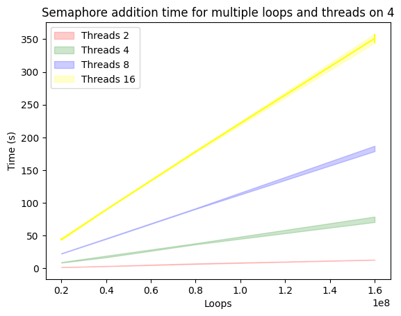
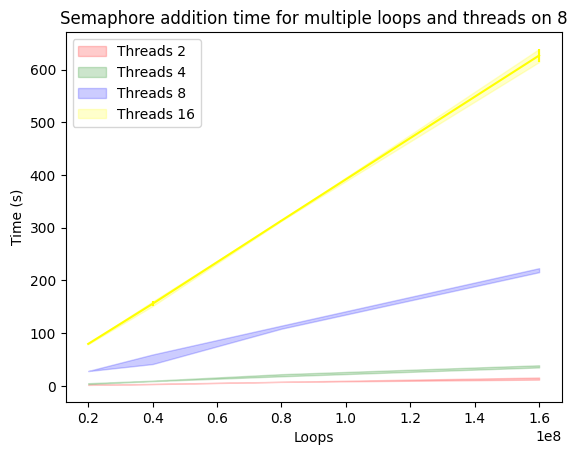
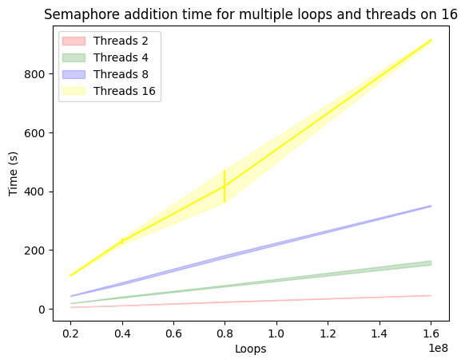

# CS313fa22 -- Assignment 6

Name: Thomas Nguyen

Bonus Completed: Yes

## A description of how you modified and compiled your code.
  I modified the code in `thread_incr_psem.c` so that it uses a variable number of threads instead of the default 2 threads. 

  I compiled this program with `cc -pthread ./thread_incr_psem.c`,.
 
## A set of all the assumptions made to run the code.
  I assume that the program will use 3 instances of a 20000000, 40000000, 80000000, 160000000 loops for 2, 4, 8, 16 threads. 

## Any bugs or corner cases you have handled.
  I also assume that even though I account for errors when creating and joining threads, I do not expect for there to be any errors to occur throughout this process.

## Definition of semaphores.
  According to Zybooks, "A semaphore S is an integer variable that, apart from initialization, is accessed only through two standard atomic operations: wait() and signal()."

  In my own words, I would say that sempahores are used when two threads are trying to access the same resource and semaphores ensure that only one thread has access to that shared resource at any given time by signalling availability of a resource. 

## Definitions of "real time", "kernel time", "user time".
  Real time - is the actual time that a process takes from it's starting time to it's end time

  Kernel time - is the time that the CPU spent on a process in kernel mode

  User time - is the time that the CPU spent on a process in user mode

## Include plots from the results.

## Descriptions of trends of the plots.
  With 2 threads, the semaphore addition time is near constant with respect to the number of loops. As the number of threads increases, the semaphore addition time raises with a steeper slope with respect to the number of loops. 

## Explanation of the trend results.
  With the addition of more threads, the semaphore addition time increases becauses more threads are waiting for the signal to access the shared resource.
